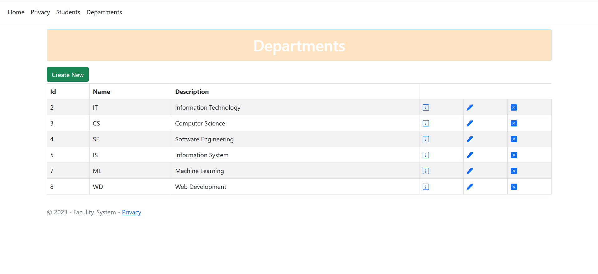

# 🏫 Mini Faculty System - ASP.NET Core MVC Web App

A web application built with ASP.NET Core MVC to manage and display information about faculty departments and their respective students.

---

## 📖 Overview

This project serves as a basic faculty management system, allowing users to:

- View a list of faculty departments.
- See students associated with each department.
- Perform CRUD operations on departments and students.

---

## 🛠 Technologies Used

- **Framework:** ASP.NET Core MVC
- **Language:** C#
- **Database:** Entity Framework Core with SQL Server
- **Frontend:** Razor Views, Bootstrap (via LibMan)
- **IDE:** Visual Studio

---

## 📁 Project Structure

- `Controllers/` - Handles HTTP requests and responses.
- `Models/` - Contains the data models: `Department` and `Student`.
- `Views/` - Razor views for UI rendering.
- `Data/` - Database context and initialization.
- `Migrations/` - Entity Framework Core migrations.
- `wwwroot/` - Static files (CSS, JS, images).
- `Screenshots/` - Contains screenshots of the application.

---

## 🚀 Getting Started

1. **Clone the repository:**
   ```bash
   git clone https://github.com/Mekkawy94/Mini-facuty-system.git


## 📷 Screenshots





 
